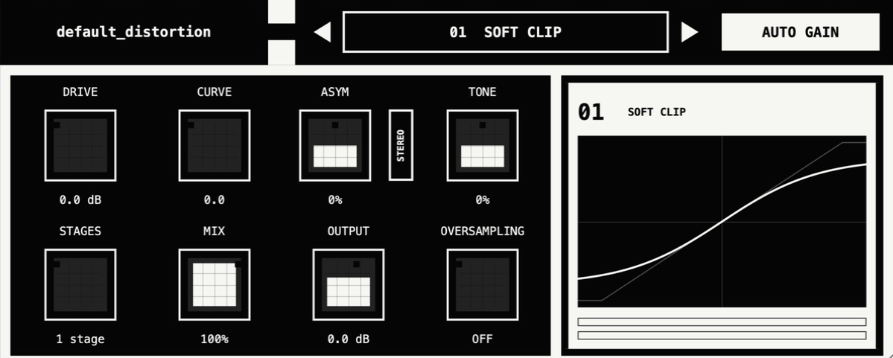

# default_distortion



~~I~~ ChatGPT made `default_distortion` because one day I had nothing to do
and wanted a free, convenient everyday saturator. I used as much AI as
possible and did nothing myself. It contains a bunch of the most default
saturation algorithms that have already appeared absolutely everywhere. We
even stole some of the code from other developers.*

Future plans: add a multiband mode.

\* In boring legal terms: copied or adapted code from open-source projects
under their GPL-compatible licences.

## Thanks and third-party code

- [Vital](https://github.com/mtytel/vital) by Matt Tytel and contributors —
  GPLv3 soft-clip and hard-clamp code.
- [CHOW Tape Model](https://github.com/jatinchowdhury18/AnalogTapeModel) and
  [BYOD](https://github.com/Chowdhury-DSP/BYOD) by Jatin Chowdhury and
  contributors — GPLv3 tape-hysteresis code.
- [JUCE](https://github.com/juce-framework/JUCE) — AGPLv3 plug-in framework.
- Exact revisions and licences:
  [`THIRD_PARTY_NOTICES.md`](THIRD_PARTY_NOTICES.md).

## Algorithms

1. Soft Clip
2. Hard Clip
3. Diode Clipper
4. Triode Stage
5. Transistor / FET
6. Tape Hysteresis
7. Harmonic Morph
8. Phase Distortion
9. Spectral Clip
10. Sign / Square
11. Zero-Square
12. Full-Wave Rectifier
13. Soft Full-Wave
14. Transformer Core
15. Class-B Saturation
16. Topology Fold
17. Recursive Foldback
18. Sine Fold
19. Chebyshev Fold
20. Modulo Wrap
21. Downsample
22. Bit Crusher
23. Bit Rotation
24. Delta Crusher
25. Slew Limiter
26. Schmitt Hysteresis
27. Feedback Saturator
28. Resonant Feedback Clip
29. Dynamic Sag
30. Sine Erosion

## Build

```sh
cmake -S . -B build -DCMAKE_BUILD_TYPE=Release
cmake --build build --config Release --parallel
ctest --test-dir build --output-on-failure
```

## Licence

default_distortion is open source under `AGPL-3.0-only`. The adapted CHOW/BYOD
hysteresis source remains `GPL-3.0-only` and is combined under GPLv3 section 13.
See `LICENSE.md`, `LICENSES/`, and `THIRD_PARTY_NOTICES.md`.
