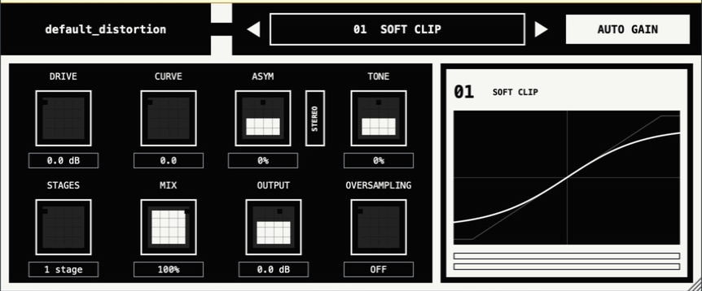

# default_distortion



~~Я~~ ChatGPT сделал `default_distortion`, потому что мне как-то раз было
нечего делать и я хотел бесплатный и удобный сатуратор на каждый день. Я
использовал как можно больше ИИ и ничего не делал сам. В нём собрана пачка
максимально дефолтных алгоритмов сатурации, которые уже встречались вообще
везде. А часть кода мы вообще украли у других разработчиков.*

Планы на будущее — добавить мультибэнд-режим.

\* В скучном юридическом смысле: скопировали или адаптировали код из
open-source-проектов на условиях их GPL-совместимых лицензий. Авторы, исходные
репозитории, точные ревизии и изменения перечислены ниже и в
[`THIRD_PARTY_NOTICES.md`](THIRD_PARTY_NOTICES.md).

## Thanks and third-party code

- **Matt Tytel and Vital contributors** — Vital's GPLv3 rational soft-clip
  transfer and hard-clamp implementation are adapted in Soft Clip and Hard
  Clip. Thank you for making an exceptional synthesizer and its DSP source
  available to everyone: [Vital](https://github.com/mtytel/vital).
- **Jatin Chowdhury and the CHOWDSP/BYOD contributors** — Tape Hysteresis is a
  scalar adaptation of the GPLv3 Jiles-Atherton implementation from
  [CHOW Tape Model](https://github.com/jatinchowdhury18/AnalogTapeModel) and
  [BYOD](https://github.com/Chowdhury-DSP/BYOD). Thank you for the unusually
  clear open-source analogue-modelling work.
- **The JUCE team and contributors** — the plug-in, formats, host integration,
  DSP utilities, GUI, and cross-platform build use
  [JUCE](https://github.com/juce-framework/JUCE) 8.0.15 under AGPLv3.

Copyright notices, licence texts, source revisions, adapted files, and a
summary of our changes are in [`THIRD_PARTY_NOTICES.md`](THIRD_PARTY_NOTICES.md)
and [`LICENSES/`](LICENSES/). Please do not remove those files from redistributed
source or binary packages.

default_distortion contains 30 deliberately different saturation, clipping,
folding, digital-destruction, circuit-inspired, phase, and spectral algorithms.
The interface is derived from a black-and-white geometric cover image: large
hard-edged fields, negative-space crosses, square controls, and monochrome
typography.

## Download

Ready-to-use macOS, Windows, and Linux packages are available on the
[latest release page](https://github.com/lsooxlla8/default_distortion/releases/latest).

## Formats

| Platform | Formats |
| --- | --- |
| macOS 11+ | AU, VST3, Standalone |
| Windows 10+ x64 | VST3, Standalone |
| Linux x64 | VST3, LV2, Standalone |

The DSP, state, and scalable GUI share the same JUCE implementation on all
three operating systems. Platform build instructions and release details are
in [`BUILDING.md`](BUILDING.md).

## Controls

- **Mode**: one of 30 algorithms.
- **Drive**: 0 to 36 dB.
- **Character**: mode-specific second parameter. It is 0–100% by default and
  bipolar only for algorithms where negative polarity has a real meaning.
- **Asym**: polarity-dependent drive, threshold, bias, or state response.
  The adjacent vertical **Stereo** button changes it to a linked stereo mode:
  the displayed amount is applied to the left channel and the same amount with
  opposite polarity to the right channel. Mono processing remains unchanged.
- **Tone**: matched pre/post tilt around 1 kHz. The pre-tilt determines which
  frequencies hit the nonlinearity; the inverse post-tilt approximately
  restores the original broadband balance without removing new harmonics.
- **Stages**: one through eight state-aware serial stages.
- **Mix**: latency-aligned dry/wet blend.
- **Output**: -24 to +12 dB.
- **Oversampling**: off, 2x, 4x, or 8x; Off is the default.
- **Auto Gain button**: cycles through Off, Auto Gain, and Smart Auto Gain.
  Auto Gain applies deterministic, mode-specific calibration. Smart Auto Gain
  waits for the controls to settle, compares dry and wet using ITU-R BS.1770
  K-weighting and gated 400 ms loudness blocks, and freezes the resulting
  correction until a relevant control, including Tone, changes. It does not continuously
  follow programme level like a compressor. A determinate progress bar and
  moving scanner show both settling and measurement.
- **Logo**: clicking `default_distortion` inverts the complete monochrome
  palette; clicking it again restores the original colours.

`Stages` and oversampling are independent. Every stage receives the same full
Drive, Character, Asymmetry, threshold, quantiser, or sample clock and feeds
its output into the next identical processor. Stateful modes keep separate
state per stage; there are no hidden stage-dependent variations or
stage-count-dependent weakening.

## Algorithms

1. Soft Clip
2. Hard Clip
3. Diode Clipper
4. Triode Stage
5. Transistor / FET
6. Tape Hysteresis
7. Harmonic Morph
8. Phase Distortion
9. Spectral Clip
10. Sign / Square
11. Zero-Square
12. Full-Wave Rectifier
13. Soft Full-Wave
14. Transformer Core
15. Half-Wave Rectifier
16. Class-B Saturation
17. Topology Fold
18. Recursive Foldback
19. Sine Fold
20. Chebyshev Fold
21. Modulo Wrap
22. Downsample
23. Bit Crusher
24. Bit Rotation
25. Delta Crusher
26. Slew Limiter
27. Schmitt Hysteresis
28. Feedback Saturator
29. Resonant Feedback Clip
30. Dynamic Sag

Phase Distortion is an audio-rate, input-modulated fractional delay. Its base
delay is exactly 0 ms; Drive expands the positive modulation range continuously
up to 50 ms. Character is the modulator low-pass Tone control (50% when the
algorithm is selected), and Asym biases the delay modulation. There is no
envelope follower, level normalisation, control-rate update, or hidden
modulator smoothing beyond the selected Tone filter.

Most modes use a continuous smoothstep depth law in addition to pre-drive.
Soft Clip, Soft Full-Wave, and Slew Limiter retain their direct-cascade
response. Hard Clip uses the same continuous dry-to-driven-shaper topology as
Diode Clipper, so Drive 0 is neutral and every position above it changes both
the processor and the preview without a zero-only branch. At Character 0,
Soft Clip and Hard Clip use scalar
copies of Vital's GPLv3 rational `futils::tanh` soft clip and bounded hard
clamp. Soft Clip Character morphs continuously from the Vital transfer to a
bounded cubic soft clip. Hard Clip Character morphs continuously from Vital's
hard clamp to Vital's soft clip. Soft Clip and Soft Full-Wave are
intentionally already active at Drive=0; increasing Drive changes them
continuously instead of crossing a zero-only bypass boundary. Sign/Square,
Zero-Square, and Full-Wave likewise use continuous transfers rather than a
zero-only bypass.

Topology Fold selects three genuinely different parallel folding structures:
Single, Dual, and a non-uniform three-cell West Coast topology. Its piecewise
folding transfer uses first-order antiderivative anti-aliasing. Recursive Fold
uses Character for reflection strength, while Sine Fold uses it for curvature,
so neither Character control merely repeats Drive.

Half-Wave Rectifier morphs from a smooth conducting junction to an ideal
precision half-wave transfer; its precision end uses antiderivative
anti-aliasing. Full-Wave Rectifier and Class-B Saturation open at 50%
Character when selected.

Spectral Clip uses a 256-sample, four-times-overlapped FFT. The plug-in reports
a fixed latency and internally aligns dry and wet paths so that mode and
oversampling changes do not shift the Mix control.

The response display and audio processor call the same serial-cascade function,
including the same Drive, Character, Asymmetry, and Stages laws. Stateful
algorithms use a time-domain view. Spectral Clip is also shown in the time
domain by running a deterministic saw wave, phased as
0 → +1 / −1 → 0, through the same
256-sample STFT, magnitude shaper, inverse FFT, Hann overlap-add, and latency
alignment as the audio path. Tone filtering, output gain, dry/wet mix, DC
blocking, and Auto Gain are intentionally outside this algorithm-core display.
The algorithm menu uses these same visualizations as compact icons. With Stereo
Asym enabled, the main graph represents the left-channel (+Asym) transfer.
Hard Clip keeps the full -1.5 to +1.5 display span. Its preview uses exactly
the same cascade function and continuous Drive interpolation as its audio
processor; at zero Drive this naturally produces the same neutral line as
Diode Clipper, without any visualization-only special case.

The editor uses one uniform geometry scale. Knobs, the Stereo button, borders,
labels, and value readouts retain their proportions at every supported window
size instead of scaling text and controls independently.

Parameter-derived DSP coefficients are calculated once per block instead of
inside every sample and stage. Deterministic Auto Gain recalibration after
control edits is coalesced on a worker thread; the initial value is prepared
before playback. Zero Tone bypasses unity filters, and unchanged response
graphs reuse their cached waveform.

Bit Crusher maps Drive from 24-bit through 1-bit quantisation.
Character rounds the edges of the quantiser staircase itself; it is not a
dry/wet blend or temporal error follower. Its cubic range is deliberately
weighted so that 50–100% continues to make a substantial change, while 0%
remains the full-strength hard quantiser. Downsample maps Drive from the host
sample rate down to approximately 1 Hz. Its Character control glides
sample-and-hold transitions; at 0% the hold is unsmoothed. Their nominal bit
depth and clock do not change when Oversampling is enabled. Bit Rotation spans
zero through 15 bits.

Class-B Saturation replaces the former Bitwise Logic mode with a continuous
push-pull class-B conduction-gap transfer. Character changes the bias gap
rather than selecting arbitrary bit operations. The old “Crossover
Saturation” name was technically about crossover distortion, but was renamed
to avoid implying a frequency crossover that the algorithm does not contain.

Tape Hysteresis uses a scalar adaptation of the GPLv3 Jiles-Atherton
Newton-Raphson model from CHOW Tape Model/BYOD. Attribution and exact source
revisions are recorded in `THIRD_PARTY_NOTICES.md`.

## Build

The first configure downloads JUCE 8.0.15 with CMake FetchContent.

```sh
cmake -S . -B build -DCMAKE_BUILD_TYPE=Release
cmake --build build --config Release --parallel
ctest --test-dir build --output-on-failure
```

Build products are placed under:

```text
build/DefaultDistortion_artefacts/Release/
```

On macOS, the relevant products are normally:

```text
AU/default_distortion.component
VST3/default_distortion.vst3
Standalone/default_distortion.app
```

To install manually:

```text
AU   → ~/Library/Audio/Plug-Ins/Components/
VST3 → ~/Library/Audio/Plug-Ins/VST3/
App  → ~/Applications/
```

macOS builds receive a local ad-hoc signature automatically. Public
distribution still requires the developer's Apple Developer ID signature and
notarization.

## Tests

`DefaultDistortionTests` checks:

- exactly 30 unique algorithm names and Character labels;
- finite, non-silent processing from every mode;
- coarse output diversity across the set;
- meaningful one-stage versus eight-stage processing;
- regression checks that eight-stage Tape, Transformer, Schmitt, Feedback, and
  Resonant Feedback processing cannot collapse back toward dry;
- Auto Gain, Phase Distortion, and visualization on a constrained 512 KiB host
  thread stack, matching the REAPER crash regression;
- off, 2x, 4x, and 8x oversampling paths;
- Character-dependent visualization for all 30 algorithms;
- bounded Auto Gain matching for every algorithm;
- pairwise behavioural separation across Drive/Character/stage combinations;
- transfer-function invariants for folding, rectification, hard and spectral
  clipping;
- maximum Drive, Character, Asymmetry, Tone, Stages, Output, and 8x
  oversampling for every mode;
- the one-Hertz Downsample extreme;
- continuous Drive onset and useful Drive range for Soft Clip, Soft
  Full-Wave, Sign/Square, Zero-Square, and Full-Wave Rectifier;
- active zero-Drive transfers for Soft Clip and Soft Full-Wave;
- nonlinear Zero-Square behaviour at Character 0;
- a host-rate Downsample clock that is invariant under Oversampling;
- measured alias reduction from 8x Oversampling on Hard Clip;
- frozen Smart Auto Gain behaviour after its measurement window;
- Smart Auto Gain progress and locked-state reporting;
- Smart Auto Gain measurement restart after a Tone edit;
- exact +Asym left / -Asym right Stereo Asym processing;
- deterministic level recovery for Spectral Clip;
- distinct Single, Dual, and West Coast folding transfers;
- strong, distinct Class-B Saturation Character settings;
- Drive-controlled 24-to-1-bit and host-rate-to-1-Hz digital modes;
- raw, midpoint, and fully smoothed Bit Crusher plus Downsample transitions;
- true 0 ms Phase Distortion at Drive 0 and a non-clipping phase-delay path;
- distinct Full-Wave and Soft Full-Wave transfers;
- copied Vital transfer regression checks plus 0 dBFS-or-higher clip ceilings
  for Soft Clip and Hard Clip across their
  Character range;
- exact Vital-to-cubic and Vital-hard-to-Vital-soft Character endpoints;
- a full-path flat +/-1 Hard Clip plateau with Tone and Oversampling off;
- exact 0 → +1 / -1 → 0 saw-wave Spectral Clip input/output visualization;
- rapid background Auto Gain recalibration and clean worker shutdown;
- a post-processing 0 dBFS sample ceiling for all modes when Output is 0 dB.

## Licence

default_distortion is open source under `AGPL-3.0-only`. The adapted CHOW/BYOD
hysteresis source remains `GPL-3.0-only` and is combined under GPLv3 section 13.
See `LICENSE.md`, `LICENSES/`, and `THIRD_PARTY_NOTICES.md`.
